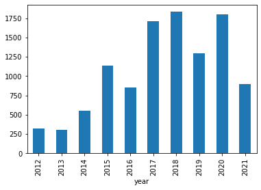
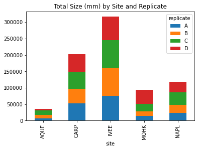

# Working With Pandas DataFrames in Python

We can automate the process of performing data manipulations in Python. It's efficient to spend time
building the code to perform these tasks because once it's built, we can use it
over and over on different datasets that use a similar format. This makes our
methods easily reproducible. We can also easily share our code with colleagues
and they can replicate the same analysis.

### Starting in the same spot

To help the lesson run smoothly, let's ensure everyone is in the same directory.
This should help us avoid path and file name issues. At this time please
navigate to the workshop directory. If you are working in Jupyter Notebook be sure
that you start your notebook in the workshop directory.

A quick aside that there are Python libraries like [OS Library][os-lib] that can work with our
directory structure, however, that is not our focus today.

### Our Data

For this lesson, we will be using a subset of data from an ongoing study called Abundance, size and fishing effort for California Spiny Lobster (Panulirus interruptus);
 provided by SBC LTER: Reef ([Santa Barbara Coastal, Long Term Ecological Research](https://sbclter.msi.ucsb.edu/)).
This data contains records on the abundance and size of California spiny lobster along the mainland coast of the Santa Barbara Channel. Spiny lobsters are an important predator in giant kelp forests off southern California. The sites where the observations where recorded are called Marine Protected Areas (MPA), where SBC: LTER and affiliates are able to investigate the effects of fishing on kelp forest community dynamics.

We are studying the size and abundance of lobsters recorded in sites in our study
area. The dataset is stored as a `.csv` file: each row holds information for a
single animal, and the columns represent:

| Column           | Description                                                    |
|------------------|----------------------------------------------------------------|
| record_id        | Unique id for the observation                                  |
| site             | Abbreviation of the site sampled                               |
| transect         | 40m transects at 0, 8, 16, 24, 32, and 40m                     |
| replicate        | Code for the lobster transect, A-D are arranged south to north |
| size_mm          | Visual estimate of lobster carapace length                     |
| month            | month of observation                                           |
| year             | year of observation                                            |
| date             | date of observation                                            |

The first few rows of our first file look like this:

~~~
,record_id,site,transect,replicate,size_mm,year,month,date
1,IVEE,1,A,,0,300,2012,8,2012-08-20,1
2,IVEE,5,B,62.0,0,300,2012,8,2012-08-20,2
3,IVEE,5,B,86.0,0,300,2012,8,2012-08-20,3
4,IVEE,5,B,105.0,0,300,2012,8,2012-08-20,4
5,IVEE,5,C,,0,300,2012,8,2012-08-20,5
6,IVEE,5,D,,0,300,2012,8,2012-08-20,6
7,IVEE,6,A,,0,300,2012,8,2012-08-20,7
8,IVEE,6,B,57.0,0,300,2012,8,2012-08-20,8
9,IVEE,6,B,60.0,0,300,2012,8,2012-08-20,9
10,IVEE,6,C,,0,300,2012,8,2012-08-20,10
~~~
{: .output}

---

## About Libraries
A library in Python contains a set of tools (called functions) that perform
tasks on our data. Importing a library is like getting a piece of lab equipment
out of a storage locker and setting it up on the bench for use in a project.
Once a library is set up, it can be used or called to perform the task(s)
it was built to do.

## Pandas in Python
One of the best options for working with tabular data in Python is to use the
[Python Data Analysis Library][pandas] (a.k.a. Pandas). The
Pandas library provides data structures, produces high quality plots with
[matplotlib][matplotlib] and integrates nicely with other libraries
that use [NumPy][numpy] (which is another Python library) arrays.

Python doesn't load all of the libraries available to it by default. We have to
add an `import` statement to our code in order to use library functions. To import
a library, we use the syntax `import libraryName`. If we want to give the
library a nickname to shorten the command, we can add `as nickNameHere`.  An
example of importing the pandas library using the common nickname `pd` is below.

~~~
import pandas as pd
~~~
{: .language-python}

Each time we call a function that's in a library, we use the syntax
`LibraryName.FunctionName`. Adding the library name with a `.` before the
function name tells Python where to find the function. In the example above, we
have imported Pandas as `pd`. This means we don't have to type out `pandas` each
time we call a Pandas function.

# Reading CSV Data Using Pandas

We will begin by locating and reading our lobster data which are in CSV format. CSV stands for
Comma-Separated Values and is a common way to store formatted data. Other symbols may also be used, so
you might see tab-separated, colon-separated or space separated files. It is quite easy to replace
one separator with another, to match your application. The first line in the file often has headers
to explain what is in each column. CSV (and other separators) make it easy to share data, and can be
imported and exported from many applications, including Microsoft Excel. For more details on CSV
files, see the [Data Organisation in Spreadsheets][spreadsheet-lesson5] lesson.
We can use Pandas' `read_csv` function to pull the file directly into a [DataFrame][pd-dataframe].

## So What's a DataFrame?

A DataFrame is a 2-dimensional data structure that can store data of different
types (including characters, integers, floating point values, factors and more)
in columns. It is similar to a spreadsheet or an SQL table or the `data.frame` in
R. A DataFrame always has an index (0-based). An index refers to the position of
an element in the data structure.

~~~
# Note that pd.read_csv is used because we imported pandas as pd
pd.read_csv("data/lobsters_data.csv")
~~~
{: .language-python}

The above command yields the **output** below:

~~~
       record_id  site  transect replicate  size_mm  year  month        date
0              1  IVEE         1         A      NaN  2012      8  2012-08-20
1              2  IVEE         5         B     62.0  2012      8  2012-08-20
2              3  IVEE         5         B     86.0  2012      8  2012-08-20
3              4  IVEE         5         B    105.0  2012      8  2012-08-20
4              5  IVEE         5         C      NaN  2012      8  2012-08-20
  ...   ...       ...       ...      ...   ...    ...         ...
10698      10699  NAPL         2         C    101.0  2021      8  2021-08-26
10699      10700  NAPL         2         D     75.0  2021      8  2021-08-26
10700      10701  NAPL         2         D    136.0  2021      8  2021-08-26
10701      10702  NAPL         2         C     85.0  2021      8  2021-08-26
10702      10703  NAPL         1         C     66.0  2021      8  2021-08-26

[10703 rows x 8 columns]
~~~
{: .output}

We can see that there were over 10,000 rows parsed. Each row has 8
columns. The first column is the index of the DataFrame. The index is used to
identify the position of the data, but it is not an actual column of the DataFrame.
It looks like  the `read_csv` function in Pandas  read our file properly. However,
we haven't saved any data to memory so we can work with it. We need to assign the
DataFrame to a variable. Remember that a variable is a name for a value, such as `x`,
or  `data`. We can create a new  object with a variable name by assigning a value to it using `=`.

Let's call the imported lobster data `lobsters_df`:

~~~
lobsters_df = pd.read_csv("data/lobsters_data.csv")
~~~
{: .language-python}

Notice when you assign the imported DataFrame to a variable, Python does not
produce any output on the screen. We can view the value of the `lobsters_df`
object by typing its name into the Python command prompt.

~~~
lobsters_df
~~~
{: .language-python}

which prints contents like above.

Note: if the output is too wide to print on your narrow terminal window, you may see something
slightly different as the large set of data scrolls past. You may see simply the last column
of data.

Never fear, all the data is there, if you scroll up. Selecting just a few rows, so it is
easier to fit on one window, you can see that pandas has neatly formatted the data to fit
our screen:

~~~
lobsters_df.head() # The head() method displays the first several lines of a file. It
                  # is discussed below.
~~~
{: .language-python}
~~~
    record_id site  transect replicate  size_mm  year  month        date
0          1  IVEE         1         A      NaN  2012      8  2012-08-20
1          2  IVEE         5         B     62.0  2012      8  2012-08-20
2          3  IVEE         5         B     86.0  2012      8  2012-08-20
3          4  IVEE         5         B    105.0  2012      8  2012-08-20
4          5  IVEE         5         C      NaN  2012      8  2012-08-20
~~~
{: .output}

## Exploring Our Lobster Data

Again, we can use the `type` function to see what kind of thing `lobsters_df` is:

~~~
type(lobsters_df)
~~~
{: .language-python}
~~~
<class 'pandas.core.frame.DataFrame'>
~~~
{: .output}

As expected, it's a DataFrame (or, to use the full name that Python uses to refer
to it internally, a `pandas.core.frame.DataFrame`).

What kind of things does `lobsters_df` contain? DataFrames have an attribute
called `dtypes` that answers this:

~~~
lobsters_df.dtypes
~~~
{: .language-python}
~~~
record_id      int64
site          object
transect       int64
replicate     object
size_mm      float64
year           int64
month          int64
date          object
dtype: object
~~~
{: .output}

All the values in a column have the same type. For example, months have type
`int64`, which is a kind of integer. Cells in the month column cannot have
fractional values, but the size_mm column can, because it
has type `float64`. The `object` type doesn't have a very helpful name, but in
this case it represents strings (such as 'A' and 'B' in the case of replicate).

We'll talk a bit more about what the different formats mean in a different lesson.

### Useful Ways to View DataFrame objects in Python

There are many ways to summarize and access the data stored in DataFrames,
using attributes and methods provided by the DataFrame object.

To access an attribute, use the DataFrame object name followed by the attribute
name `df_object.attribute`. Using the DataFrame `lobsters_df` and attribute
`columns`, an index of all the column names in the DataFrame can be accessed
with `lobsters_df.columns`.

Methods are called in a similar fashion using the syntax `df_object.method()`.
As an example, `lobsters_df.head()` gets the first few rows in the DataFrame
`lobsters_df` using **the `head()` method**. With a method, we can supply extra
information in the parens to control behaviour.

Let's look at the data using these.

> ## Challenge - DataFrames
>
> Using our DataFrame `lobsters_df`, try out the attributes & methods below to see
> what they return.
>
> 1. `lobsters_df.columns`
> 2. `lobsters_df.shape` Take note of the output of `shape` - what format does it
>    return the shape of the DataFrame in?
>
>    HINT: [More on tuples, here][python-datastructures].
> 3. `lobsters_df.head()` Also, what does `lobsters_df.head(15)` do?
> 4. `lobsters_df.tail()`
{: .challenge}

## Calculating Statistics From Data In A Pandas DataFrame

We've read our data into Python. Next, let's perform some quick summary
statistics to learn more about the data that we're working with. We might want
to know how many animals were collected in each site, or how many of each
species were caught. We can perform summary stats quickly using groups. But
first we need to figure out what we want to group by.

Let's begin by exploring our data:

~~~
# Look at the column names
lobsters_df.columns
~~~
{: .language-python}

which **returns**:

~~~
Index(['record_id', 'site', 'transect', 'replicate', 'size_mm', 'year',
       'month', 'date'],
      dtype='object')
~~~
{: .output}

Let's get a list of all the species. The `pd.unique` function tells us all of
the unique values in the `replicate` column.

~~~
pd.unique(lobsters_df['replicate'])
~~~
{: .language-python}

which **returns**:

~~~
array(['A', 'B', 'C', 'D'], dtype=object)
~~~
{: .output}

> ## Challenge - Statistics
>
> 1. Create a list of unique site ID's ("site") found in the data. Call it
>   `site_names`. How many unique sites are there in the data? How many unique
>   species are in the data?
>
> 2. What is the difference between `len(site_names)` and `lobsters_df['site'].nunique()`?
{: .challenge}

# Groups in Pandas

We often want to calculate summary statistics grouped by subsets or attributes
within fields of our data. For example, we might want to calculate the average
size of all individuals per site.

We can calculate basic statistics for all records in a single column using the
syntax below:

~~~
lobsters_df['size_mm'].describe()
~~~
{: .language-python}
gives **output**

~~~
count    10237.000000
mean        74.927029
std         13.369367
min         18.000000
25%         68.000000
50%         75.000000
75%         83.000000
max        230.000000
Name: size_mm, dtype: float64
~~~
{: .language-python}

We can also extract one specific metric if we wish:

~~~
lobsters_df['size_mm'].min()
lobsters_df['size_mm'].max()
lobsters_df['size_mm'].mean()
lobsters_df['size_mm'].std()
~~~
{: .language-python}

But if we want to summarize by one or more variables, for example sex, we can
use **Pandas' `.groupby` method**. Once we've created a groupby DataFrame, we
can quickly calculate summary statistics by a group of our choice.

~~~
# Group data by site
grouped_data = lobsters_df.groupby('site')
~~~
{: .language-python}

The **pandas function `describe`** will return descriptive stats including: mean,
median, max, min, std and count for a particular column in the data. Pandas'
`describe` function will only return summary values for columns containing
numeric data.

~~~
# Summary statistics for all numeric columns by sex
grouped_data.describe()
# Provide the mean for each numeric column by sex
grouped_data.mean()
~~~
{: .language-python}

`grouped_data.mean()` **OUTPUT:**

~~~
        record_id  transect    size_mm         year     month
site                                                         
AQUE  3408.500724  4.191027  72.868283  2016.079595  8.167873
CARP  5599.795430  4.259193  73.737765  2017.729382  8.000000
IVEE  5876.226540  4.251896  76.116947  2018.083649  8.001422
MOHK  4882.804332  1.512635  68.628978  2016.854874  8.000000
NAPL  4783.184932  4.267746  80.322931  2017.016812  8.000000
~~~
{: .output}

The `groupby` command is powerful in that it allows us to quickly generate
summary stats.

> ## Challenge - Summary Data
>
> 1. Which site has the highest count of observed lobsters? Which has the lowest?
> 2. What happens when you group by two columns using the following syntax and
>    then calculate mean values?
>   - `grouped_data2 = lobsters_df.groupby(['site', 'replicate'])`
>   - `grouped_data2.mean()`
> 3. Summarize size values for each site in your data.  HINT: you can use the
>   following syntax to only create summary statistics for one column in your data.
>   `by_site['size_mm"].describe()`
>
>
>> ## Did you get #3 right?
>> **A Snippet of the Output from challenge 3 looks like:**
>>
>> ~~~
>>         count       mean        std   min   25%   50%   75%    max
>>  site                                                             
>>  CARP  2738.0  73.737765  11.737286  32.0  67.0  75.0  81.0  183.0
>>          ...
>> ~~~
>> {: .output}
> {: .solution}
{: .challenge}

## Quickly Creating Summary Counts in Pandas

Let's next count the number of samples for each species. We can do this in a few
ways, but we'll use `groupby` combined with **a `count()` method**.

~~~
# Count the number of samples by year
year_counts = lobsters_df.groupby('year')['record_id'].count()
print(year_counts)
~~~
{: .language-python}

Or, we can also count just the rows that have the year `2021`:

~~~
lobsters_df.groupby('year')['record_id'].count()[2021]
~~~
{: .language-python}

> ## Challenge - Make a list
>
>  What’s another way to create a list of years and associated count of lobsters in the data?
>  records in the data? Hint: you can perform `count`, `min`, etc. functions on
>  groupby DataFrames in the same way you can perform them on regular DataFrames.
{: .challenge}

## Basic Math Functions

If we wanted to, we could perform math on an entire column of our data. For
example let's multiply all size values by 10. A more practical use of this might
be to normalize the data according to a mean, area, or some other value
calculated from our data.

~~~
# Multiply all size values by 10
lobsters_df['size_mm']*10
~~~
{: .language-python}

# Quick & Easy Plotting Data Using Pandas

We can plot our summary stats using Pandas, too.

~~~
# Make sure figures appear inline in Ipython Notebook
%matplotlib inline
# Create a quick bar chart
year_counts.plot(kind='bar');
~~~
{: .language-python}

Count per species site

We can also look at how many lobsters were counted in each site:

~~~
site_transect = lobsters_df.groupby('SITE')['record_id'].nunique()
# Let's plot that too
site_transect.plot(kind= 'bar');
~~~
{: .language-python}

> ## Challenge - Plots
>
> 1. Create a plot of average size (mm) per year.
> 2. Create a plot of total lobster counts at each site for the entire dataset.
{: .challenge}

> ## Summary Plotting Challenge
>
> Create a stacked bar plot, with size on the Y axis, and the stacked variable being replicate.
> The plot should show total size by replicate for each site. Some
> tips are below to help you solve this challenge:
>
> * For more information on pandas plots, see [pandas' documentation page on visualization][pandas-plot].
> * You can use the code that follows to create a stacked bar plot but the data to stack
>  need to be in individual columns.  Here's a simple example with some data where
>  'a', 'b', and 'c' are the groups, and 'one' and 'two' are the subgroups.
>
> ~~~
> d = {'one' : pd.Series([1., 2., 3.], index=['a', 'b', 'c']), 'two' : pd.Series([1., 2., 3., 4.], index=['a', 'b', 'c', 'd'])}
> pd.DataFrame(d)
> ~~~
> {: .language-python }
>
> shows the following data
>
> ~~~
>       one  two
>   a    1    1
>   b    2    2
>   c    3    3
>   d  NaN    4
> ~~~
> {: .output}
>
> We can plot the above with
>
> ~~~
> # Plot stacked data so columns 'one' and 'two' are stacked
> my_df = pd.DataFrame(d)
> my_df.plot(kind='bar', stacked=True, title="The title of my graph")
> ~~~
> {: .language-python }
>
> 
>
> * You can use the `.unstack()` method to transform grouped data into columns
> for each plotting.  Try running `.unstack()` on some DataFrames above and see
> what it yields.
>
> Start by transforming the grouped data (by site and sex) into an unstacked layout, then create
> a stacked plot.
>
>
>> ## Solution to Summary Challenge
>>
>> First we group data by site and by sex, and then calculate a total for each site.
>>
>> ~~~
>> by_site_rep = lobsters_df.groupby(['site', 'replicate'])
>> site_rep_count = by_site_rep['size_mm'].sum()
>> ~~~
>> {: .language-python}
>>
>> This calculates the sums of size for each sex within each site as a table
>>
>> ~~~
>> site  replicate
>> AQUE  A             6774.8
>>       B            10205.0
>>       C            14156.0
>>       D             4934.0
>> CARP  A            52465.0
>>       B            44610.0
>>       C            51185.0
>>       D            53634.0
>> IVEE  A            74909.0
>>       B            84233.0
>>       C            86251.5
>>       D            71253.0
>> MOHK  A            14238.0
>>       B            14096.7
>>       C            22518.0
>>       D            43169.0
>> NAPL  A            23007.0
>>       B            25334.0
>>       C            37518.0
>>       D            32537.0
>> Name: size_mm, dtype: float64
>> ~~~
>> {: .output}
>>
>> Below we'll use `.unstack()` on our grouped data to figure out the total size that each replicate contributed to each site.
>>
>> ~~~
>> by_site_rep = lobsters_df.groupby(['site', 'replicate'])
>> site_rep_count = by_site_rep['size_mm'].sum()
>> site_rep_count.unstack()
>> ~~~
>> {: .language-python }
>>
>> The `unstack` method above will display the following output:
>>
>> ~~~
>> replicate        A        B        C        D
>> site                                         
>> AQUE        6774.8  10205.0  14156.0   4934.0
>> CARP       52465.0  44610.0  51185.0  53634.0
>> IVEE       74909.0  84233.0  86251.5  71253.0
>> MOHK       14238.0  14096.7  22518.0  43169.0
>> NAPL       23007.0  25334.0  37518.0  32537.0
>> ~~~
>> {: .output}
>>
>> Now, create a stacked bar plot with that data where the size for each replicate are stacked by site.
>>
>> Rather than display it as a table, we can plot the above data by stacking the values of each replicate as follows:
>>
>> ~~~
>> by_site_rep = lobsters_df.groupby(['site', 'replicate'])
>> site_rep_count = by_site_rep['size_mm'].sum()
>> srp = site_rep_count.unstack()
>> s_plot = srp.plot(kind='bar', stacked=True, title="Total Size (mm) by Site and Replicate")
>> s_plot.set_ylabel("Size (mm)")
>> s_plot.set_xlabel("Site")
>> ~~~
>> {: .language-python}
>>
>> 
> {: .solution}
{: .challenge}

Data Set Citation

Reed, D, R. Miller. 2022. SBC LTER: Reef: Abundance, size and fishing effort for California Spiny Lobster (Panulirus interruptus), ongoing since 2012 ver 7. Environmental Data Initiative. [https://doi.org/10.6073/pasta/2a648dfc72949d0f5e1352ecdd973de5](https://doi.org/10.6073/pasta/2a648dfc72949d0f5e1352ecdd973de5). Accessed 2022-02-14.

[ernst]: http://www.esapubs.org/archive/ecol/E090/118/default.htm
[figshare-ndownloader]: https://ndownloader.figshare.com/files/2292172
[os-lib]: https://docs.python.org/3/library/os.html
[matplotlib]: https://matplotlib.org
[numpy]: https://www.numpy.org/
[pandas]: https://pandas.pydata.org
[pandas-plot]: http://pandas.pydata.org/pandas-docs/stable/user_guide/visualization.html#basic-plotting-plot
[pd-dataframe]: https://pandas.pydata.org/pandas-docs/stable/getting_started/dsintro.html#dataframe
[pptd]: https://figshare.com/articles/Portal_Project_Teaching_Database/1314459
[python-datastructures]: https://docs.python.org/3/tutorial/datastructures.html#tuples-and-sequences
[spreadsheet-lesson5]: http://www.datacarpentry.org/spreadsheet-ecology-lesson/05-exporting-data


